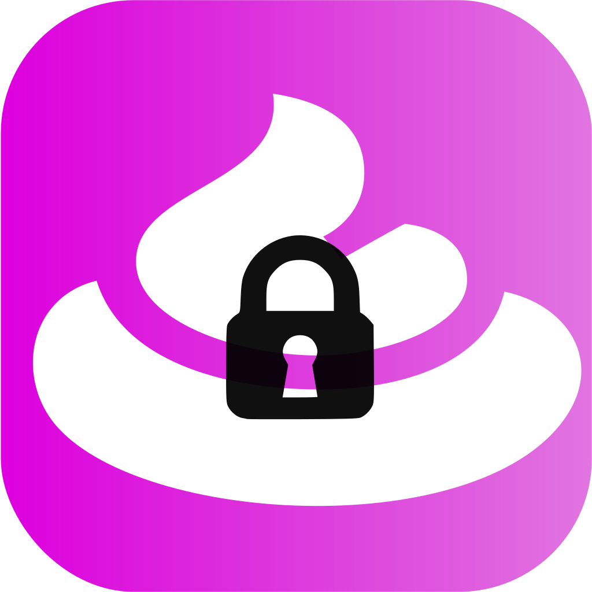
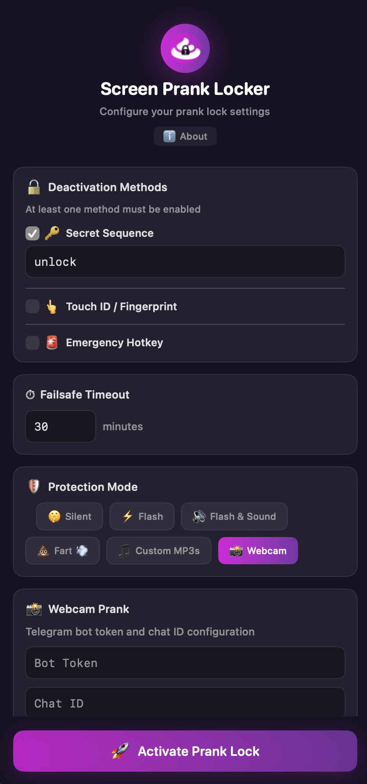

# Screen Prank Locker

[](https://github.com/SlashGordon/ScreenPrankLocker/actions/workflows/ci.yml)

<p align="center">
  
</p>

<p align="center">
  
</p>

A macOS prank app that locks the screen with transparent overlays, blocks all keyboard/mouse/trackpad input, and trolls anyone who tries to use your computer. Deactivate by typing a secret sequence, using Touch ID, or with an emergency key combo.

## Features

- **Full-screen overlay** covering all connected displays
- **6 protection modes** — silent, flash, flash & sound, fart sounds, custom MP3s, or webcam photo capture
- **Webcam prank** — photographs the intruder and displays the photo on-screen with a funny caption
- **Touch ID unlock** — authenticate with biometrics to deactivate
- **Multi-display support** — dynamically adapts when monitors are connected/disconnected
- **Configurable emergency stop** hotkey to instantly kill the session
- **Failsafe timeout** to auto-deactivate after a set duration
- **Persistent configuration** saved to `~/.prank-locker/config.json`

## Requirements

- macOS 13.0+
- Swift 5.9+ / Xcode 15+

## Quick Start

```bash
swift build
.build/debug/ScreenPrankLocker
```

On first launch the app requests all required permissions (Accessibility, Camera, Touch ID), then shows the configuration window. Adjust your settings and click **Activate Prank Lock** to start a session.

## Build

### Debug

```bash
swift build
```

### Release App Bundle

```bash
make app        # Creates build/ScreenPrankLocker.app
```

### Installer Package / DMG

```bash
make pkg        # Creates build/ScreenPrankLocker-1.0.0.pkg
make dmg        # Creates build/ScreenPrankLocker-1.0.0.dmg
```

### Installation
/Applications/ScreenPrankLocker.app/Contents/MacOS/ScreenPrankLocker
Because this tool interacts with system security and the camera, macOS Gatekeeper will initially block it since it is an unsigned binary. You will need to strip the quarantine attribute after downloading it.

1. Go to the Releases page and download the latest ScreenPrankLocker-x.x.x.dmg file.

2. Open the .dmg and drag the app into your /Applications folder.

3. Open your Terminal and run the following command to remove the Apple quarantine flag:

```bash
/usr/bin/xattr -cr /Applications/ScreenPrankLocker.app
```

You can now launch the app normally from your Applications folder or Spotlight.

### Other Make Targets

| Target  | Description                        |
|---------|------------------------------------|
| `build` | Compile release binary             |
| `app`   | Build .app bundle                  |
| `pkg`   | Build macOS installer package      |
| `dmg`   | Build disk image with drag-install |
| `install` | Copy .app to /Applications       |
| `test`  | Run test suite                     |
| `run`   | Build & run in one step            |
| `clean` | Remove build artifacts             |

## How It Works

1. **Launch** — the app requests permissions, then shows a configuration window
2. **Configure** — set your deactivation sequence, protection mode, timeout, etc.
3. **Activate** — click the Start button (or use the global hotkey / CLI flag)
4. **Locked** — transparent overlays cover all screens, all input is intercepted
5. **Deactivate** — type the secret sequence blind, use Touch ID, or hit the emergency stop combo

## Activation

| Method | Default |
|--------|---------|
| Config window | Click **Activate Prank Lock** |
| Global hotkey | **Ctrl + Option + Cmd + L** |
| CLI flag | `--activate` |

## Deactivation

| Method | Default |
|--------|---------|
| Secret sequence | Type `unlock` while locked |
| Touch ID | Fingerprint on supported Macs |
| Emergency stop | **Ctrl + Option + Cmd + Q** (configurable) |
| Failsafe timeout | Auto-deactivates after 30 minutes |

## Protection Modes

Controls how the lock screen reacts when someone tries to interact:

| Mode | Behavior |
|------|----------|
| **Silent** | No visual or audio feedback |
| **Flash** | Screen flashes white (default) |
| **Flash & Sound** | Flash + configurable system alert sound |
| **Fart Prank** | Plays random fart sounds with cooldown |
| **Custom MP3s** | Plays random `.mp3` files from a configured directory |
| **Webcam Prank** | Captures a photo of the intruder with the webcam, displays it on-screen with a funny caption |

## Configuration

Settings are stored in `~/.prank-locker/config.json` (created on first run):

```json
{
    "activationShortcut": { "modifiers": ["control", "option", "command"], "keyCode": 37 },
    "deactivationSequence": "unlock",
    "imageIntervalSeconds": 3.0,
    "maxSimultaneousImages": 15,
    "failsafeTimeoutMinutes": 30,
    "protectionMode": "flash",
    "alertSoundName": "Basso",
    "fartSoundsDirectory": "~/.prank-locker/sounds/farts/",
    "customSoundsDirectory": "~/.prank-locker/sounds/custom/",
    "fartCooldownSeconds": 3.0,
  "emergencyStopShortcut": { "modifiers": ["control", "option", "command"], "keyCode": 12 },
  "telegramBotToken": null,
  "telegramChatID": null
}
```

### Telegram Integration

The Webcam Prank mode can optionally send the captured intruder photo to a Telegram chat. To enable this, add `telegramBotToken` and `telegramChatID` to your `~/.prank-locker/config.json`.

Steps:

1. Create a bot with @BotFather on Telegram and copy the bot token.
2. Obtain the target chat ID (message the bot and check `getUpdates` or use a helper bot like @userinfobot).
3. Add the values to your config. Minimal keys:

```json
"telegramBotToken": "123456:ABC-DEF1234ghIkl-zyx57W2v1u123ew11",
"telegramChatID": "987654321"
```

Example webcam-focused configuration:

```json
{
  "activationShortcut": { "modifiers": ["control", "option", "command"], "keyCode": 37 },
  "deactivationSequence": "unlock",
  "imageIntervalSeconds": 3.0,
  "maxSimultaneousImages": 15,
  "failsafeTimeoutMinutes": 30,
  "protectionMode": "webcamPrank",
  "alertSoundName": "Basso",
  "fartSoundsDirectory": "~/.prank-locker/sounds/farts/",
  "customSoundsDirectory": "~/.prank-locker/sounds/custom/",
  "fartCooldownSeconds": 3.0,
  "emergencyStopShortcut": { "modifiers": ["control", "option", "command"], "keyCode": 12 },
  "telegramBotToken": "123456:ABC-DEF1234ghIkl-zyx57W2v1u123ew11",
  "telegramChatID": "987654321"
}
```

Keep your bot token private; anyone with it can send messages as your bot.

### Custom Prank Images

Drop PNG or JPEG files into `~/.prank-locker/images/`. Falls back to built-in defaults if empty.

### Custom Fart Sounds

Place `.mp3` files in `~/.prank-locker/sounds/farts/` or change the directory in config. The app ships with 8 built-in fart sounds.

### Custom MP3 Mode

Set Protection Mode to `Custom MP3s`, then point the app at any directory containing `.mp3` files. A random file from that directory will be played on each interaction attempt.

### Alert Sounds (Flash & Sound mode)

Any macOS system sound name works: `Basso`, `Blow`, `Bottle`, `Frog`, `Funk`, `Glass`, `Hero`, `Morse`, `Ping`, `Pop`, `Purr`, `Sosumi`, `Submarine`, `Tink`.

## Permissions

On first launch the app requests all required permissions upfront:

| Permission | Purpose | Required? |
|-----------|---------|-----------|
| **Accessibility** | Intercept keyboard & mouse events to block input | **Yes** — core functionality won't work without it |
| **Camera** | Capture intruder photos in Webcam Prank mode | Optional — webcam prank gracefully degrades |
| **Touch ID** | Biometric unlock | Optional — falls back to keyboard sequence |

If Accessibility is not granted, the app will guide you to **System Settings → Privacy & Security → Accessibility** to enable it.

### Resetting Permissions

If you need macOS to prompt again for camera or accessibility access, reset the app's TCC entries:

```bash
tccutil reset Camera com.pranklocker.screenpranklocker
tccutil reset Accessibility com.pranklocker.screenpranklocker
```

After resetting, relaunch the app and macOS should show the permission prompts again.

## Running Tests

```bash
swift test
```

The test suite includes unit tests and property-based tests (via [SwiftCheck](https://github.com/typelift/SwiftCheck)).


## License

Private project.
